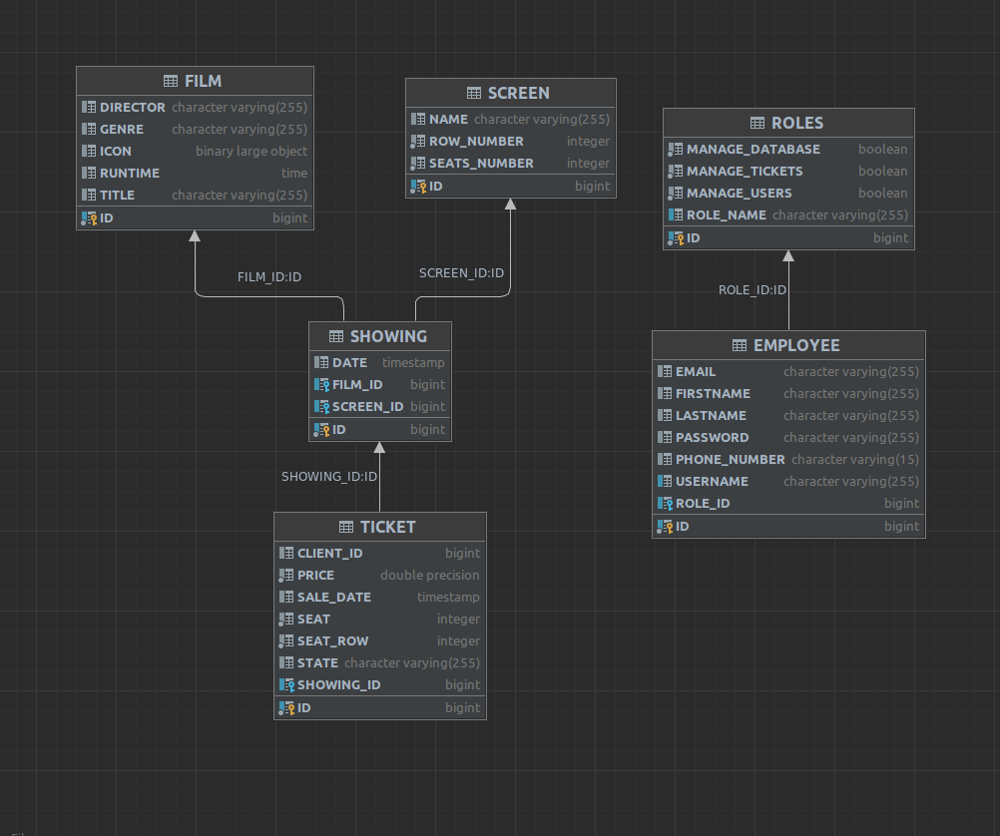
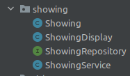
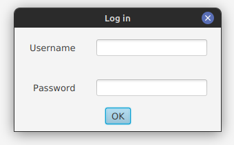
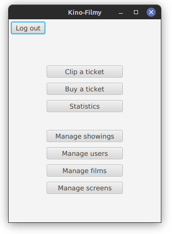
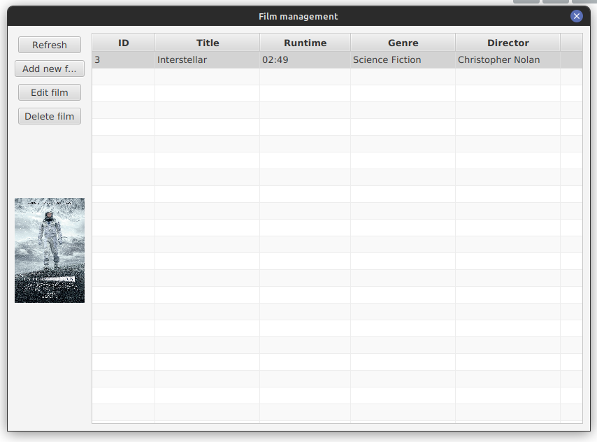

# Aplikacja Kino-Filmy

## Schemat bazy danych



- Film - Zawiera podstawowe informacje o każdym filmie
- Screen - Sale kinowe
- Showing - Seans z kluczem obcym na film
- Ticket - Sprzedawany na konkretny seans, zawiera także stan np. sprzedany, zwrócony, skasowany, niewykorzystany

- Roles - zawiera role użtykownika aplikacji oraz uprawnienia do wykonywania konkretnychoperacji
- Employee - tabela użytkowników i ich dane
  

## Schemat aplikacji

W pakiecie model dla każdej tabeli znajdują się reprezentacje obiektowe, servisy, repozytoria i inne klasy związane z encją np. Showing 



#### Kluczowe klasy to:
- klasa reprezentująca encję w bazie np.:
     Film zawiera adnotację @Entity, każdą kolumnę, gettery i settery.
    ```
        @Entity
        public class Film {
        @Id
        private Long id;
        private String title;
        private LocalTime runtime;
        private String genre;
        private String director;

        @Lob
        @Column(length = 10485760)
        private byte[] icon;
        .
        .
        .
    ```
- serwis
    Przykładowe użycie FilmService. Serwisy korzystają z repozytorium.
    ```
        @Service
        @Transactional
        public class FilmService {

            private final FilmRepository repository;

            public FilmService(FilmRepository repository) {
                this.repository = repository;
            }


            public List<Film> findAll(){
                return this.repository.findAll();
            }
        .
        .
        .
    ```
- repozytorium
    Przykładowe repozytorium FilmRepository. Serwisy korzystają z deklaracji funkcji tu zdefiniowanych.
    ```
    public interface FilmRepository extends JpaRepository<Film, Long> {
        public boolean existsFilmById(long id);

        @Query("SELECT m, COUNT(t) FROM Film m INNER JOIN Showing s ON s.film = m inner join Ticket t on t.showing = s WHERE t.saleDate = :date GROUP BY m.id ORDER BY COUNT(t.id) DESC")
        List<Object[]> findFilmsByTicketsSoldOnDate(@Param("date") Date date);
    }
    ```

### Kontrolery

Kontrolery to klasy odpowiadające za logikę aplikacji oraz za poprawne reagowanie na akcje użytkownika w interfejsie. Wykorzystują klasy Encji i serwisy do przeprowadzania operacji. 

Kontrolery posiadają powiązania z elementami interfejsu takimi jak przyciski, pola tekstowe, miejsca na wyświetlanie danych.

W naszej aplikacji główną rolę spełnia ```KinoFilmyApplicationController``` odpowiedzialny za przełączanie między różnymi widokami. Każda zmiana widoku sprowadza się do załadowania pliku FXML i wyświetlenie go w nowym okienku.

### Przykład ładowania głównego widoku
```
public void initRootLayout(){
        try {
            this.primaryStage.setTitle("Kino-Filmy");

            // load layout from FXML file
            FXMLLoader loader = new FXMLLoader();
            loader.setLocation(KinoFilmyApplicationController.class.getResource("/view/mainView.fxml"));
            loader.setControllerFactory(applicationContext::getBean);
            BorderPane rootLayout = loader.load();

            // set initial data into controller
            MainController controller = loader.getController();
            controller.setMainStage(primaryStage);

            // add layout to a scene and show them all
            Scene scene = new Scene(rootLayout);
            primaryStage.setScene(scene);
            login();
            if(userRole != null){
                primaryStage.show();
            }
        } catch (IOException e) {
            // don't do this in common apps
            e.printStackTrace();
        }
    }
```    

Każdy widok także ma swój kontroler. 

### Widoki

Wszystkie widoki są zapisane w plikach fxml

Na początku ładowane jest okienko logowania aplikacji.


Po zalogowaniu wyświetla się główny panel 


##### Przykładowy widok - Manage films
